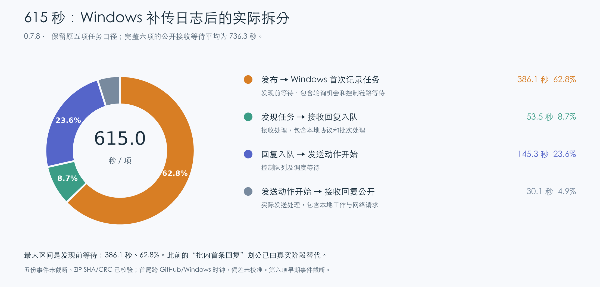

# Windows 补传数据：615 秒结论修订与 Issue #13

分析快照：2026-10-09T14:19:10.649187+00:00。原始任务 ID 未重发、锁未清理。6/6 结果 ZIP 与6/6 诊断 ZIP 均已校验 SHA-256、字节数、CRC 和运行身份，五台不同机器的 SSH、开机信息、A5 型号探测均通过。此处没有运行 NPU 计算负载。

## 修正此前对 615 秒的解释

615 秒是当时完成的五项任务平均值。Windows 补传日志后，同样五项可以拆成以下真实阶段，不再用“本批第一条确认出现前/后”作为内部归因：

| 阶段 | 平均秒 / 项 | 占 615 秒 |
|---|---:|---:|
| 发布 → Windows 首次记录任务 | 386.1 | 62.8% |
| 发现任务 → 接收回复入队 | 53.5 | 8.7% |
| 回复入队 → 发送动作开始 | 145.3 | 23.6% |
| 发送动作开始 → 接收回复公开 | 30.1 | 4.9% |

**最大区间是任务被 Windows 发现之前的等待（62.8%），其次是接收回复入队后等待发送（23.6%）。** 前一回复引用的旧版 76.5% 是历史数据，不能用来表示本轮的内部大头。发现前等待不能再拆成 CPU、HTTP、未轮询和退避的精确份额：覆盖这个时段的十秒 connector 窗口已不在回传范围。

原五项的事件未截断，逐项时刻及 Flush operation_id 见 docs/evidence/issue13-timing-refinement.json；每项分段非负、合计与各自公开 task→accepted 间隔一致。首尾阶段跨 GitHub 与 Windows 时钟，偏差未经校准；内部处理及队列区间使用 Windows 同机时间。

第六项已完成，全部六项的公开“发布→接收确认”平均为 **736.3 秒**。其 accepted/discovery 早期事件截断，不能将它记为零或替它编造内部阶段；原五项饼图保留原始统计对象。

## 新发现及边界

最后一项 machine-audit-d27acab66349/8/run-20261009-v078-parallel-01 的本地准入→Claim 入队为 **12343.6 秒（3 小时 25 分 43.6 秒）**。保留事件中有 921 条 RESOURCE_BUSY；这证明记录了资源门控等待，但不证明具体哪一个服务器进程占用或为何未释放。资源获取动作本身仅约 0.046 秒，不能把那三小时解释为 SSH 调用或 Pi 启动耗时。

完整六项提交→回执平均 **3339.7 秒（55.7 分钟）**；旧版对应六项为 2015.1 秒（33.6 分钟）。这个完整历史对照受最后一项资源等待影响，不能沿用之前仅五项完成时的改善结论，也不是隔离版本因果的 A/B 实验。Pi 结束→公开结果平均从 905.1 秒降至 286.8 秒，但不抵消本轮长尾资源等待。

十秒窗口按 source/session/window 去重，6 份包共1063 个唯一窗口，分段求和错误0、保留范围内中间缺号0；全部窗口导出均有 windows_truncated=true。connector 最早保留窗口是 **10:59:51Z**，晚于原五项09:06–09:26Z 的发布/接收区间。因此后期 CPU 比例不能填入615秒饼图。

在保留且处于批次观测区间内的733个 connector 完整窗口（7330秒）中，Canonical 5904.8秒（80.6%）、JSON解析767.3秒（10.5%）、HTTP275.5秒（3.8%）。进程CPU6242.6秒；CPU不是可加的墙钟切片。这支持后期本地规范化/解析为热点，但不能据此声明早期615秒同样80.6%花在Canonical，也不能把重复 outbox 条目清理的收益推算为80.6%。

## Issue #13 与修复范围

Issue描述与源码一致：exportDiagnostics 先检查 connector.running/dirty/queue 和全部任务状态，导致已经 receipt 的诊断长期无法入队。重启后6份包补传成功，说明旧实现并非一次性错过即永远丢失，而是全局屏障造成饥饿；长时间延迟进一步使保留日志被截断。

0.7.9取消全局空闲屏障，只等待本任务receipt和自身交付完成，诊断仍以单请求、低优先级、串行状态访问发送。增加持久化12次/24小时重试预算及显式expired状态；不终止在途上传，冻结SHA保持不变。已receipt且在可信账本中确认一致的confirmed outbox记录清理，events/comments/claims保留。未决、拒绝或冲突条目不删除。

此修复解决诊断交付与重复闭环簿记问题；**尚未验证它能将386秒的发现等待降低到多少，也未修复或查明最后一项资源占用者**。后续性能工作应先取得早期发现区间覆盖，再针对 Poll准入、串行控制占用和Canonical实际工作量建立配对验证，不能直接增加Pi并行度后宣称问题已解决。

证据：docs/evidence/issue13-timing-refinement.json、windows-window-audit.json、timings.json、各运行delivery-diagnostics.zip及verification.json。完整总体报告见REPORT.md。
