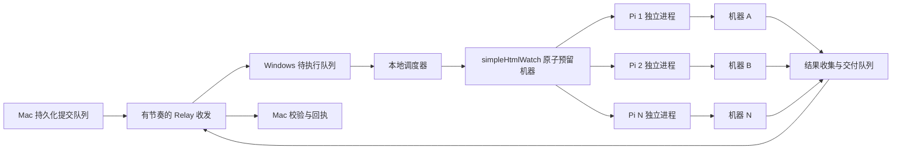

# 并行任务与机器占用设计

状态：完整目标设计，2026-09-28；现状分析依据 AIConnector 0.6.4（`2c785590e2c22a3cd0b388d052b4b24286e44db2`）。0.7 已实现首版 Pi 池、资源预留、独立监督/交付与限速发送，实际安装配置及尚未交付的部分以 [并行操作说明](PARALLEL-OPERATIONS.md) 为准。本文完整示例中的 resources/modelPool 等规划字段尚未实现，不可整段复制到配置。

目标：Mac 可以批量发布独立任务；Windows 同时运行多个相互隔离的 Pi；不同机器可以并行，同一物理机器上的冲突任务互斥；某个任务等待资源、执行未知或上传失败，不阻塞无关机器。

## 1. 当前实现为什么排队

| 层次 | 当前行为 | 源码位置 | 改动方向 |
| --- | --- | --- | --- |
| 服务循环 | 轮询、输入上传、提交、Runner 调度共用一个 `busy` 循环，逐项等待 | `service/server.mjs`，`tick()` | 拆分本地调度、通道同步、交付队列 |
| Connector | 所有 PowerShell 调用通过 `tail` 排队；脚本持有状态文件锁 | `service/connector.mjs`，`call()`；`Connector.ps1`，`state.lock` | 保留单一账本写入者，缩短事务，不让网络等待挡住本地领取 |
| Relay 发送 | `Flush-One` 每次最多尝试一条事件，按事件哈希排序；建 Issue/Release 还需等待写入间隔 | `Connector.ps1`，`Flush-One` | 独立、有节奏地排空待发队列，跨任务公平调度 |
| Pi | 存在任意 `launching/running/claiming/unknown` 就停止派发，启动一个子进程后返回 | `service/runner.mjs`，`tick()` | 有界 Pi 池，按实际资源判断是否可派发 |
| 交付 | `reconcile()` 等待 Upload 和 Complete，之后才继续调度 | `service/runner.mjs`，`reconcile()` | 结果就绪立即进入独立交付队列 |
| 服务器 | simpleHtmlWatch 在互斥区内选择机器并持久化，然后异步执行 | simpleHtmlWatch `internal/watch/tasks.go`，`Submit/readyLocked` | 复用现有执行器，增加覆盖整个任务的资源预留 |

因此可以有多个“已发布/已接收”的任务，但当前 Windows 只能运行一个 Pi。把 `maxTurns` 调大不能开启并行，直接删掉 Runner 的全局判断也不完整。

simpleHtmlWatch 已排除有未结束任务的 `machineId` 和相同 `host:port`；不同机器的任务通过独立 goroutine 执行。但这只是一个控制器内、一次 SSH 任务期间的占用，不是跨控制器的物理机器锁，也不覆盖 Pi 多次诊断与修复之间的间隙。

## 2. 目标结构和首版边界



首版建议上限为 4 个 Pi、每台物理机器 1 个排他任务；根据模型 API 配额和 Windows 内存可降为 1 或 2。每个任务沿用独立的进程、会话、输入、产物和运行目录，不在同一个 Pi 会话内同时处理多个用户目标。单个 Pi 的有副作用工具仍顺序执行。

首版只支持一个 Windows 调度服务及一个权威 simpleHtmlWatch 控制器管理这批机器，不承诺多个 Windows 节点共享 Relay 就能安全抢同一个任务。后者还需要节点身份、领取仲裁和共同的资源管理服务。

以 8 个不同机器的任务为例：前 4 个获得各自机器后开始，后 4 个等待 Pi 槽位；任意一个结束后立即补位。如果两个任务指向同一台机器，后者等待，但可以跳过它调度队列中指向另一台空闲机器的任务。

## 3. 分开调度与通道

本地调度器由任务变化、进程退出和资源变化唤醒，并用约 1 秒的定时检查兜底。GitHub 拉取仍可以每 60 秒一次；不再以这个间隔检查 Pi 退出、释放槽位或启动下一项已接收任务。

通道保留有界串行请求，按平台限流要求发送。GitHub 官方建议串行请求，并在写请求之间至少等待 1 秒；实际沿用本地更保守的写入间隔，遇到限流服从响应头和退避。任务执行并行不要求 HTTP 请求同时涌向 GitHub。[官方依据](https://docs.github.com/en/rest/using-the-rest-api/best-practices-for-using-the-rest-api)

待发调度不再按事件哈希排序：同一 run 严格保持父事件依赖，不同 run 按队列轮转；每次处理一项有界操作就让出，控制与结果消息可优先但不能使新任务无限等待。不同 run 可以交错推进建 Issue、建 Release、task、accepted 和 result，不必等一项任务拿到 receipt 才处理下一项。

Connector 改造必须保持单一状态写入者。新模式将网络操作分为“持久化意图 → 网络请求 → 持久化观察结果”，网络等待期间允许处理本地 Claim 等短事务；操作结果提交时核对原 run、事件 ID 和账本版本。旧 CLI 接口由同一个写入者受理或在服务占用时明确拒绝，不允许两个进程各自拿旧快照覆盖账本。不能直接对现有 `connector.call()` 使用 `Promise.all` 或删除文件锁。

网络断开时，已经完成输入校验、取得本地领取许可的任务可以继续执行。尚未接收的任务当然仍需等待通道恢复。结果 ZIP 上传、下载回验和 receipt 独立重试，不占 Pi 槽位或机器使用权。

## 4. 机器锁由程序管理

### 4.1 资源身份与范围

锁键由 Windows 的受信任配置和机器目录决定，不能由公开任务文本或模型任意声明。任务只能从已授权入口的机器范围中选择。

- `machine:<physical-id>`：整个物理服务器，首版排他。多个入口、多个 IP 或 SSH 端口指向同一物理机时必须配置为同一身份；不能用入口名称当锁键。
- `workspace:<canonical-path>`：同一共享代码或输出目录的写入互斥，防止本机 command 入口或不同机器写同一个共享路径。
- `config:server-registry` 等：具有修改共享配置权限的维护操作额外持有对应配置锁。运行中的任务使用冻结配置，不被后来的修改替换。

固定机器在派发前预留；group/自动选择由权威控制器原子选定机器并返回身份，之后冻结进 spec，Pi 不能自行换到未预留机器。未声明资源范围的旧入口仍可在串行兼容模式运行，但不能直接进入并行池。

首版探测、维护、实验均按排他处理。以后可单独为经过审查的固定只读探测引入共享锁，不能依靠模型自称“只读”开放共享。多机任务需要一次原子获取全部资源，不能边持有部分机器边等待其余机器；首版不满足此条件则拒绝并行多机任务。

### 4.2 生命周期

1. 任务已经 accepted，预检目标、入口、输入和权限；写入稳定的调度序号。
2. 同时满足 Pi 槽位和资源条件时，先落盘领取/预留意图，再调用控制器原子预留。预留暂时失败进入 `waiting_resource`，不启动模型；任一步执行权限不确定时进入恢复核对，不派发。
3. 取得本地 Claim 许可、资源预留和完整冻结 spec 后才启动 Pi；已有 Claim 保持原 runKey，不重复领取。主服务崩溃后仅有启动意图不构成重新启动许可。
4. 各实验、维护工具执行前均由程序验证资源 owner 和代次。控制器拒绝过期 owner；模型提示词不是加锁实现。
5. 修复、复验仍需修改同一环境时保留预留，防止另一任务插入改变基线。
6. 已证实全部远端命令结束、不再计划操作该机器、必要结果已形成不可变快照后释放。Pi 如还需总结本地结果，可不再持有机器；一旦释放，禁止旧任务再次发起远端变更。
7. 公网上传及 Mac 回执不在持锁期间。收集失败若能证明进程结束且产物目录隔离，可转为独立收集工作；否则保留该资源并明确原因。

预留记录至少保存 `resourceKey、ownerRunKey、generation、workerId、serverTaskIds、state、heartbeatAt`。获取、续约、查询和释放都须幂等；更换 owner 时增加 generation，旧进程不能释放或修改新 owner 的资源。

### 4.3 中断与未知状态

心跳超时只是启动核对，不能自动解锁。重启先恢复账本和资源占用，查询原 simpleHtmlWatch task ID 与真实进程，再开放未受影响的资源。不能因为 model budget 耗尽或本地 Pi 退出，就推断服务器也已结束。

某台机器执行未知，只隔离那台机器及其共享目录。其他机器仍可派发。若无法从旧记录确定其影响范围，则仅对无法排除冲突的资源池暂停派发；不能凭空缩小隔离范围。

仍存活的 Pi 继续占用进程槽位。确定 Pi 已停止、或受控暂停并撤销其工具调用权限后，才可释放槽位；此时远端机器仍可保持 unknown 占用。旧进程与失联远端操作不会因租约过期自动消失。

simpleHtmlWatch 现有占用应扩展为“任务预留 + 具体 SSH 作业”，使一个 run 的多次修复可以共用预留；控制器网页或其他 API 客户端提交的任务也必须遵守预留。只在 AIConnector 内做锁，挡不住 simpleHtmlWatch 的其他客户端。

人工 SSH、不经过控制器的脚本或另一套独立控制器仍不在这个锁域内。NPU 进程检查和健康预检要保留，`ready` 不等于 NPU 空闲。若要覆盖这些使用方式，需要共同的服务器侧启动守卫或统一调度器；GitHub 评论和本地超时不能替代它。

## 5. 等待不消耗模型轮次

等待机器、等待模型配额、等待远端固定任务完成、等待 ZIP 上传都由确定性程序处理，不让 Pi 反复问“完成了吗”。当前 `WatchExecution.run()` 已用程序轮询远端任务，应保留这个特点。

调度按优先级、accepted 时间与持久化序号选择可运行任务，跳过资源冲突项并通过等待时间提升优先级，避免长期饥饿。看板“最近活动”排序仅用于展示，不改变队列顺序。

每个 run 保留自身轮次、时长、工具和 token 预算；再增加按 provider 管理的并发和总预算。所有 worker 的模型请求通过本地配额代理预约额度；依据请求的 token 上限预留，流式请求结束后按实际 usage 结算，不能等 4 个进程都超额后才汇总。429 暂停对应 provider 的新模型请求，不清空机器占用或重新派发实验。请求额度不足时展示等待状态，不连续重试消耗轮次。

建议配置契约如下，仅为设计示例，当前 0.6.4 不识别这些字段：

```json
{
  "runner": {
    "maxConcurrentRuns": 4,
    "schedulerIntervalMs": 1000,
    "resources": {
      "machineConcurrency": 1,
      "unknownPolicy": "quarantine-resources"
    },
    "modelPool": {
      "maxConcurrentRequests": 4
    }
  }
}
```

provider 的总 token/费用上限按本地实际配额配置，不能简单把原单任务上限乘以 4。第一版等待远端执行的 worker 可以继续占用 Pi 槽位，但不调用模型；把长任务的 Pi 会话暂停再恢复属于后续容量优化，不影响不同机器先实现并行。

## 6. 状态、看板和回传

保留现有五阶段协议 `task → accepted → started → result → receipt`，其中 started 仍是领取确认，不能改口说它证明 SSH 已开始执行。并行不需要把同一任务拆到多个 Issue 或改变 runKey。

本地新增两个独立状态轴：

| 执行状态 | 含义 |
| --- | --- |
| accepted / waiting_resource / waiting_model | 已接收，等待明确资源或配额 |
| claiming / launching | 正在持久化领取或启动核对 |
| agent_running / remote_running / verifying | Pi、服务器或独立验收正在推进 |
| completed / blocked / unknown | 执行已闭合、明确阻塞或尚不能证明结果 |

| 交付状态 | 含义 |
| --- | --- |
| none / pending / uploading | 无产物、待交付、正在上传 |
| awaiting_receipt / confirmed | 结果已确认发布，等待或已收到 Mac 回执 |
| backoff / uncertain | 通道冷却，或写入尚未独立核实 |

看板直接显示 Pi 槽位如 `3/4`、忙机器数、等待原因、占用者、原 server task ID、最后心跳、实际阶段时间和模型消耗。分别展示执行错误和通道错误；不能因为服务总状态没有 error 就隐藏通道 TLS/限流失败。

Mac 无法直接读 Windows 本地心跳，因此如需远端显示这些状态，新增有版本的节点状态快照，走合并、低频、尽力传输的独立通道；不逐工具刷 Issue，不改写已经确认的五阶段事件。快照不可作为领取或解锁依据，过期必须展示时间与“状态可能已变化”。这部分需要两端一起升级。

每个 ZIP 增加有界、脱敏的工具错误与关键事件、原始 task ID 和分阶段时间。分别记录排队、Pi 活跃、远端命令、结果收集和交付耗时；CPU 子进程耗时不能充当 Pi 总耗时。通道未完成时的远端状态仍需保留“未确认”，不能只凭 Release 上有文件判定交付成功。

## 7. 实施顺序与升级

| 顺序 | 交付内容 | 主要改动 |
| --- | --- | --- |
| 1 | 拆分调度和交付；新增状态、持久化序号、可观察错误 | `service/server.mjs`、`service/runner.mjs`、Connector 账本写入与网络队列 |
| 2 | 资源身份、原子预留、恢复核对、代次校验 | AIConnector 资源管理模块；simpleHtmlWatch TaskManager/API；`service/watch.mjs` |
| 3 | 独立 Pi 池、共享模型配额、工具边界检查 | Runner、Worker、配置校验、能力声明、任务预检 |
| 4 | 两端看板和远端状态快照，安装包与迁移验收 | `service/web/`、打包脚本、Windows CI、升级 CLI |

这是程序与安装包升级，Windows 只改配置无法完成。完整的整任务资源锁还需要 simpleHtmlWatch 协作更新；若只用现有 simpleHtmlWatch，最多承诺其当前 SSH 作业互斥，不能宣称整个 Pi 修复过程都被锁住。

升级保留现有配置、密钥、runKey、Claim、原 server task ID 和结果队列。先按旧记录恢复正在使用及未知的资源，再启用并行。不重放现有机器检查任务，也不通过删除锁或账本制造空闲。

迁移首次保持并发 1；完成资源映射和恢复预检后，由同一次升级验收先验证 2 路再升到配置的 4 路。新安装也需完成资源预检才开放并行；预检失败给出具体缺项。安装包应提供一个统一验收入口，避免用户反复手改配置测试。

## 8. 必须通过的验收

离线 fixture 与 Windows 解压后的安装包先覆盖全部恢复位置，再到真实内网做一轮有界验收。不能仅凭页面计数或多个 Pi 进程就宣布机器并行成功。

| 用例 | 可核实的通过条件 |
| --- | --- |
| 8 个独立机器任务，池大小 4 | 远端实际执行时间区间重叠，最多 4 个 Pi；有任务退出立即补位，无需等待 GitHub 下一次 Poll |
| 两个入口/两个地址指向同一物理机 | 只有一个持有者；第二个等待，其他机器仍继续 |
| 资源或模型配额暂时不足 | 明确等待原因，等待期间模型调用数和轮次不增长 |
| 同时抢同一任务/机器 | 同一 run 只有一个有效启动许可；预留和提交保持幂等；内容不同的同 ID 请求拒绝 |
| 一个 Pi 退出或远端 unknown | 原机器保持隔离，其他资源仍可执行；不自动重提交原 SSH 作业 |
| 上传慢、TLS 失败、GitHub 429 | 本地心跳/调度继续；已确认结束的机器不因等回执被占用；通道按要求退避 |
| 在预留、Claim、spawn、POST 返回附近逐点杀主服务 | 重启核对原身份，不遗漏占用，不重复启动；旧代次不能操作新持有者的资源 |
| Pi 超时或预算用尽但远端仍运行 | Pi 结束不等于机器空闲；机器保持占用，保留原 task ID 和停止原因 |
| 结果已完整收集，公网离线 | 后续任务可用已释放机器；恢复后只交付原 ZIP，哈希与回执正确 |
| 全局维护与普通实验冲突 | 共用配置/工作目录的变更被资源锁挡住，不能只按机器不同放行 |
| 升级时有旧运行/未知运行 | 导入原状态后恢复；未知范围不能证明时不启用有冲突的并行 |

真实 Windows 验收需使用明确授权的空闲机器，先 2 路后 4 路，收集远端时间、占用日志、Pi 统计和最终 ZIP。已经运行的全机器检查保留原队列与身份；其未知任务先核对，不拿升级当重新执行许可。受控 CPU 测试只证明调度与交付，不代替 A5/NPU 实验验收。
